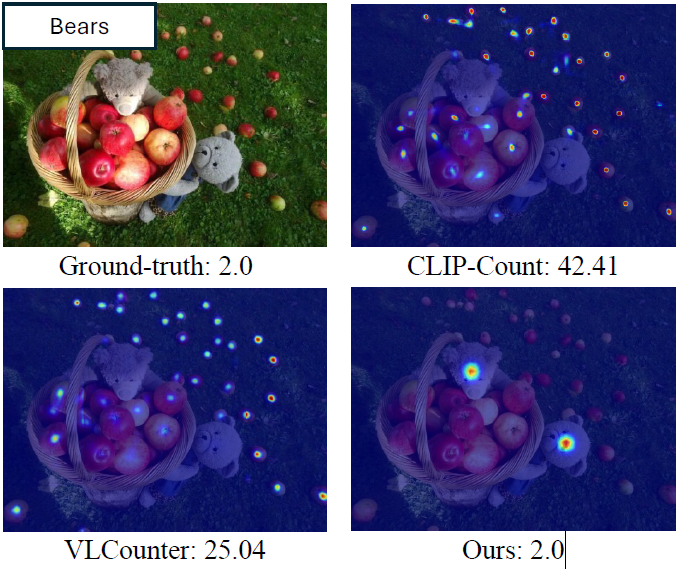

# T2ICount

### : enhancing Cross-modal Understanding for zero-shot Counting

# Abstract

- 기존 CLIP 같은 model은 text prompt에 대한 민감성이 약하다.
- T2ICount로 해결
    - Rich prior knowledge
        - 이미지의 다수의 객체가 모델의 text sensitivity를 가림
        - reannotated subset of FSC147 → FSC147s
    - fine-grained understanding from pretrained diffusion model
        - one-step denoising으로 인해 computer efficiency는 좋아지지만 text sensitivity를 떨어뜨림
        - HSCM (text, image 정렬 교정) + $L_{RRC}$ (Cross-attention map을 활용한 supervision signal)

# 문제 정의

## 문제 1. CLIP에서 이미지 내 객체가 다수가 아닌 text인 경우 sensitivity가 떨어져 객체 인식률이 낮아진다.

- 원인 : FSC-147의 evaluation bias
    - FSC-147은 이미지 마다 보통 하나의 object class만 annotation
    - 그 클래스는 대개 다수 객체 class이다. 그래서 모델이 진짜로 텍스트를 잘 읽어서 센 건지, 아니면 그냥 가장 많이 반복되는 물체를 센건지 구별이 잘 안간다.
- Counting은 기본적으로 pixel-level task이지, global level에 대한 attention이 아니다.
    - global semantic level → 다수 객체
    - local pixel level → 소수 객체

- FSC-147-S를 도입하여 문제 해결
    - 한 이미지 안에 최소 두 종류 이상 객체가 있고 원래 다수 객체가 아니라 덜 빈번한(less frequent) 클래스에 대해 추가 count annotation을 붙여서 모델이 정말 text prompt를 따라 특정 객체를 세는지 평가한다.
    - single annotation bias / majority-class bias를 더 잘 드러내기 위한 harder evaluation subset

## 문제 2. cross-attention map 시각화에서 텍스트와 무관한 영역이 강조되고, 정작 텍스트와 관련된 객체에는 attention이 일관되지 않은 text-image semantic misalignment가 나타난다.

- 원인: 실세계 적용, computer efficiency를 위해 사용한 single-step feature.
    - 이는 CLIP 자체의 global semantic bias.
    - 특히 low-level feature map일 수록 noise 특성이 더 심하다.
    
    
    
- 문제 해결
    1. Hierarchical Semantic Correction Module(HSCM) : 점진적인 semantic-visual discrepancy를 보정한다.(multi-scale feature rectification)
    2. Representaional Regional Coherence Loss($L_{RRC}$) : cross-modal alignment를 강화한다. 

# Methodology

- 목표 : $d=f(x,c), f:X×T→D$ 이미지 공간 X와 텍스트 공간 T로부터 density map 공간 D로 매핑하는 함수를 학습하고자 한다.

- VAE Encoder
    - 입력 : x 이미지
    - 출력 : latent 분포 정보($\mu , \sigma^2$) 에서 sampling 한 $z$
    - 역할 : VAE는 이미지를 더 작은 latent 공간으로 압축해서, diffusion이 원본 이미지 공간이 아니라 복원 가능한 compact latent space에서 효율적으로 동작하게 해준다.

- forward diffusion process
    - 입력 : z
    - 출력 : noisy latent $z_t$
        
        
        
    - 역할 : denoising U-net이 $z_t$를 보고 어떤 노이즈가 섞였는지 예측하고 제거하는 법을 배우기 위해 앞단에서 forward diffusing으로 노이즈를 t=1로 추가하는 과정.
- Text Encoder
    - 입력 : 텍스트 프롬프트 c
    - 출력 : 텍스트 feature c’
    - 역할 : 텍스트가 어떤 시각적 의미와 대응하는지를 담은 text vector를 출력하는 모듈이다.
        
        
        
- stable diffusion - Denoising U-net
    - 입력
        - noisy latent $z_t$
        - text feature c’
    - 출력
        - 예측된 noise $\epsilon_{\theta}$
        - U-net 내부 decoder에서 나온 multi-scale feature map $F_1, F_2, F_3, F_4$
        - cross attention map
    - 역할 : noisy latent $z_t$에서 텍스트 조건 c’을 반영하여 noise $\epsilon_{\theta}$를 예측하여 제거하고 text-image alignment를 조정한다. single-step denoising에서 얻은 feature 들을 꺼내서 counting 용 feature extractor 역할을 한다.
- HSCM
    - 입력
        - multi-scale feature map $F_1, F_2, F_3, F_4$
        - text feature c’
    - 출력
        - text aligned feature $V_1$
    - 역할 : diffusion의 single-step feature에서 부족해진 text-image alignment를 단계적으로 보정해서, 모델이 텍스트가 가리키는 객체를 더 정확히 보며 counting하도록 돕는 모듈이다.
- 위의 모듈들을 기반으로 네트워크를 decompose 하면 
$f = G(H(x,Q(c)),Q(c))→D$
    - $Q:T→C$ 는 CLIP text encoder
    - $H:X×C→F$는 $\epsilon_\theta$(denoising U-Net)
    - $G:F×C→D$는 이후 density map으로 가는 부분

## Text Intensitivity in Single-step Denoising

t=1 일 때, denoising U-net의 서로 다른 해상도 계층에서 나온 Cross-attention map

- single-step, 특히 t=1 에서는 이미지 원형은 잘 유지되지만 텍스트 조건이 충분히 반영되지 않아, cross-attention이 객체 의미보다 배경/텍스트/반복 패턴에 흔들리고, 그 결과 텍스트가 지정한 객체를 정확히 세기 어려워진다.
    - t=1의 의미 : forward 관점에서는 $z_0 →z_1$ , 즉 아주 약하게 노이즈가 섞인 상태이다. 이후 denoising U-net에서 reverse 과정을 거쳐 $z_1$의 노이즈를 예측하는 한 번의 denosing step을 본다는 뜻이다.
- 이유 : Multi-step의 denoising 과정에서 text 정보가 점진적으로 반영되어 정제가능하지만 Single-step에서는 그것이 어렵다. computing efficiency와 text-image alignment의 trade-off 관계에서 computing efficiency를 선택(single-step)

## Hierachical Semantic Correction Module(HSCM)

- Cascaded design : counting을 위한 점진적 text-image alignment 과정
    - fused feature map : $F_i'$
        
        
        
        
        

### Semantic Enhancement Module(SEM)

- SEM은 feature를 text-aware하게 만드는 모듈
- text-to-image attention 과 image-to-text attention으로 bidirectional cross-modal interaction을 수행하여 enhanced feature map $V_i$를 만든다.
- 그리고 $V_i$와 text feature c’ 으로 Text-image similarity map을 만든다.

- $L_{RRC}$의 지도를 받아, SEM은 $S_i$를 학습하는데, 이 map은 특정 class의 객체가 있는 영역을 segmentation mask처럼 잡아내도록 유도된다. 이 mask는 의미적으로 관련 영역들을 highlight하기 위해 SCM에서 attention guidance로 사용된다.

### Semantic Correction Module

- SCM은 이전 단계의 similarity map을 반영하여 feature representation을  보정해주는 모듈.

- 모델의 attention을 text관련 영역들에 redirect 해주고, counting density map 학습을 돕는다.

### Representational Regional Coherence Loss($L_{RRC}$)

- FSC-147 dataset이 point-level annotation으로 부터의 positive & negative sample로 이루어져 있다 보니. instance 수준의 annotation이 부족하다.
- single-step annotation map은 텍스트가 가키는 특정 객체 종류를 정확히 구분하는 능력은 약하지만 이미지 속에서 물체가 전체적인  foreground 영역은 비교적 잘 잡아낸다. 이러한 점에서 착안해 이 attention map을 background 픽셀을 가려내는 데 활용한다.

- 과정
    1. denoising U-Net에서 서로 다른 해상도의 Cross-attention map $A^{cross}_i$를 뽑는다.(48x48, 24x24, 12x12)
    2. 이들을 upsampling 해서 같은 해상도로 맞춰준 뒤, 가중합해서 하나의 fused attention map을 만든다. 즉, 여러 해상도에서 얻은 attention 정보를 합쳐서 하나의 foreground-like map을 만든다.
        
        
        
    3. $A^{cross}$와 GT density map $D^{gt}$를 같이 써서 PNA(Positive-Negative-Ambiguous) map을 만든다.
        - $D^{gt}$ : counting datset에는 보통 객체 위치에 대한 point annotation이 있는데 각 객체 중심점 근처에 가우시안 분포를 퍼뜨려서 2D map 형태의 정답을 만든다.
        
        
        

(e)를 보면 전경 영역을 잘 잡아내는 것을 알 수 있다. (f) 흰색: 1 , 회색:-1, 검은색:0

## Loss 정의

- $L_{reg}$ : regression Loss로 counting 자체를 잘 하게 만드는 기본 loss로 density map이 정답 density map과 비슷해지도록 학습하기 위함이다.

---

# Appendix

- Few-shot object Counting : 몇 개의 예시만 보고 같은 종류의 물체가 이미지에 몇 개 있는지 세는 문제이다. 직접 제공한 examplar에 의존하는 경향이 있다.
    - examplar 확보 비용이 크다.
    - target object의 다양성과 변동성을 완전히 포착할 수 있다. 이 때문에 bias를 초래할 수 있다.
- zero-shot : 모델이 학습 때 직접 보지 못한 대상이나 클래스도, 추가 예시나 재학습 없이 처리하는 방식.
    - 이를 처리하기 위해 CLIP을 사용한다. → Visual과 text condition의 semantic alignment gap을 줄이기 위함
    - text-guided local semantic(text to image diffusion model) : 노이즈를 제거하는 과정에서 이미지 feature가 텍스트 조건에 맞게 계속 조정된다.
        - multi-step : 실세계에 대한 다양하고 보지 못한 category에 대한 일반화 성능이 높은 반면 computational overhead가 크다.
        - one-step : text-awarness가 떨어지는 반면 computational efficiency가 높다. → HSCM으로 약해진 text-image interaction 보완.
- Cross attention-map : 텍스트의 어떤 단어를 보면서 이미지의 어느 위치에 주목하는지를 보여주는 공간적 heatmap. 이는 텍스트와 이미지처럼 서로 다른 정보 사이의 대응 관계를 계산해서 한 쪽이 다른 쪽의 중요한 부분을 선택적으로 참고하도록 하는 매커니즘
- density map : 이미지 각 위치에서 대상 객체가 얼마나 밀집해 있는지를 연속적인 값으로 나타낸 2차원 함수(또는 맵)
- misalignment : 텍스트가 가르키는 대상과, attention map이 실제로 밝게 보는 위치가 잘 맞지 않는다.
- diffusion model : 데이터에 점점 노이즈를 섞는 과정과, 그 노이즈를 다시 제거하는 과정을 학습해서 데이터를 생성하는 확률 생성 모델이다.
    - forward diffusion : 원래 데이터(예: 이미지)에 노이즈를 조금씩 추가해서 결국 거의 순수한 잡음으로 만듦 $x_0→x_1→x_2→⋯→x_T$
    - reverse diffusion : 그 잡음으로부터 노이즈를 조금씩 제거하면서 원래 데이터와 비슷한 샘플을 복원한다. $x_T→x_{T-1}→⋯→x_0$
- FSC-147 : Few-Shot Counting-147의 약자로, few-shot / class-agnostic object counting을 위해 제안된 데이터셋이야. 전체 6,135장 이미지, 147개 시각 카테고리로 이루어져 있고, 주방용품·문구류·차량·동물처럼 일상적인 다양한 물체를 포함되어 있다.
    - 분할(split): train / val / test가 클래스 기준으로 완전히 분리되어 있어. 구체적으로 89 / 29 / 29개 클래스, 3,659 / 1,286 / 1,190장 이미지로 나뉜다. 그래서 학습 때 본 적 없는 클래스에 대해 일반화 성능을 보기 좋다.
    - 어노테이션(annotation): 각 이미지에는 타깃 객체의 모든 인스턴스에 대한 dot annotation이 있고, 그중 임의의 3개 exemplar에는 axis-aligned bounding box가 제공된다. 즉, “무엇을 셀지”를 exemplar box로 지정하고, 전체 개수는 density/dot 기반으로 학습하는 구조야.
    - 카운트 범위: 이미지당 객체 수가 7개에서 3,731개까지 매우 넓고, 평균 56개 정도라서 쉬운 샘플과 매우 조밀한 샘플이 함께 있다.
    - 수집 방식: 웹에서 후보 이미지를 모은 뒤, 고해상도, 최소 7개 이상 객체, 비슷한 외형, 심한 가림 없음 같은 기준으로 수작업 필터링해 만들었다.
    - 특징
        - 원래 목적은 few-shot counting이라서, 한 이미지 안에 여러 물체 종류가 있더라도 정답은 보통 한 개 카테고리만 지정된다. 그래서 다른 카테고리 객체가 이미지 안에 있어도 정식 타깃으로는 라벨링되지 않을 수 있다.
        - 후속 연구들은 FSC-147가 대체로 단순한 장면, 두드러진 주 객체, 평범한 배경을 많이 포함해서, 특히 text-guided zero-shot counting에서는 프롬프트 민감도를 엄격하게 평가하기엔 한계가 있다고 지적하기도 했다.